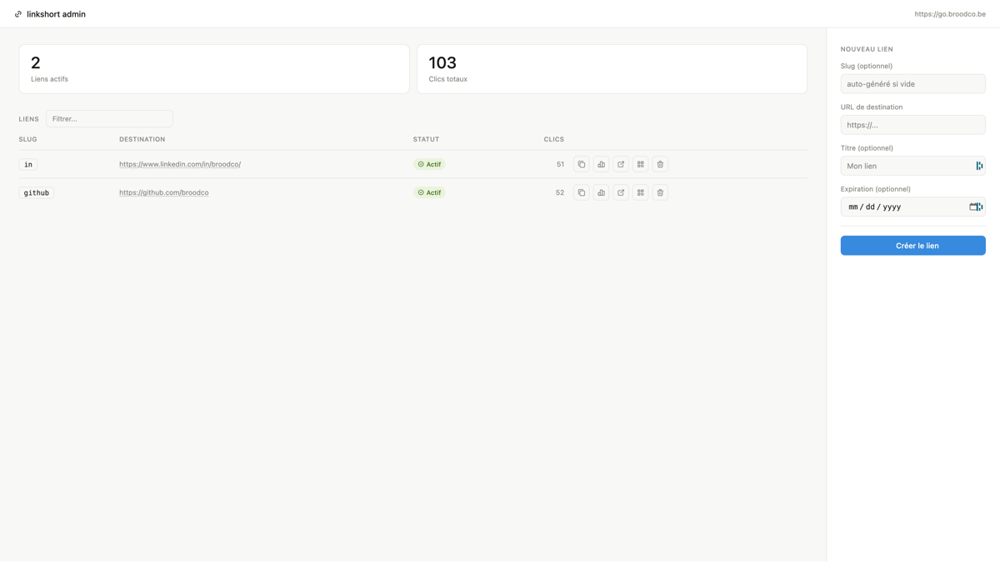
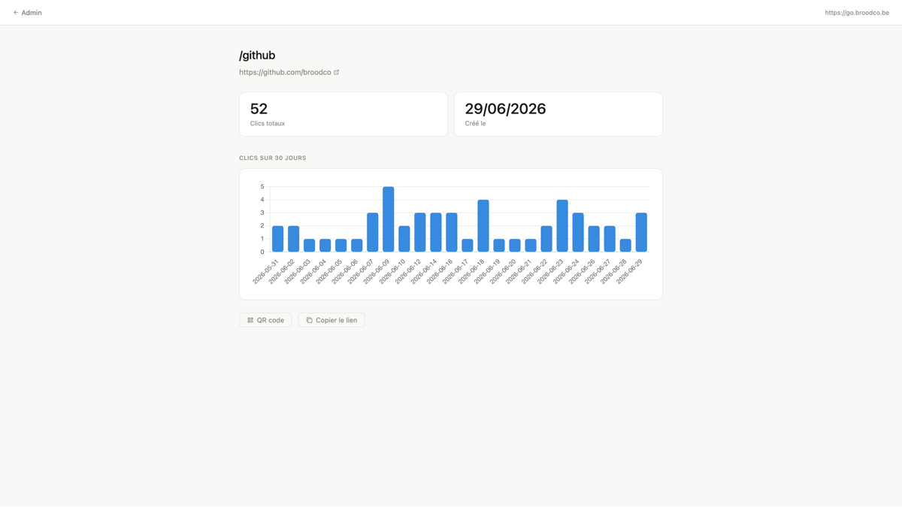
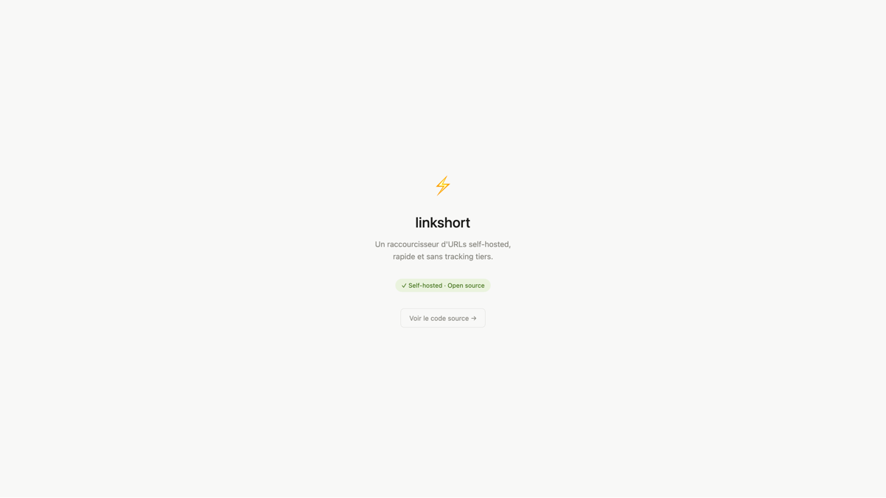

# linkshort

A self-hosted URL shortener built with Go, deployed on a Synology NAS via Docker. The app itself is intentionally simple; the real focus is a clean, reusable CI/CD pipeline with GitHub Actions, GHCR, and Watchtower.

Live at [go.broodco.be](https://go.broodco.be)


---

## Screenshots





<details>
<summary>More screenshots</summary>




</details>

---

## Features

- Custom slug shortening (`go.broodco.be/github`)
- Auto-generated slug when none is provided
- Click analytics with per-link stats (30-day chart)
- Expiring links with automatic status tracking
- QR code generation per link (PNG, cached 24h)
- Simple admin interface with HTMX (no page reloads)
- Per-IP rate limiting on redirects
- Basic auth protection on admin routes
- Self-hosted, no third-party tracking

---

## Stack

| Layer | Technology                             |
|---|----------------------------------------|
| Backend | Go 1.26 (stdlib `net/http`)            |
| Database | SQLite (`modernc.org/sqlite`, pure Go) |
| Frontend | HTML + CSS + HTMX                      |
| Charts | Chart.js                               |
| Container | Docker (multi-stage build)             |
| Registry | GitHub Container Registry (GHCR)       |
| CI/CD | GitHub Actions                         |
| Auto-deploy | Watchtower                             |
| Reverse proxy | Synology DSM native                    |
| TLS | Let's Encrypt                          |
| DNS | Cloudflare                             |

---

## Architecture

```
git push main
    ↓
GitHub Actions
    → go test + go vet
    → docker build (linux/amd64 + linux/arm64)
    → push to ghcr.io/broodco/linkshort:latest
    ↓
Watchtower (NAS, polls every 5 min)
    → detects new image
    → pulls + restarts container
    ↓
go.broodco.be ✓
```

The NAS never needs inbound SSH from CI. Watchtower handles redeployment autonomously.

---

## Project structure

```
linkshort/
├── .github/workflows/
│   └── ci.yml                  — test, build, push to GHCR
├── cmd/server/
│   └── main.go                 — entrypoint, routing
├── internal/
│   ├── assets/                 — embedded web assets (go:embed)
│   │   └── web/
│   │       ├── templates/      — .gohtml templates
│   │       └── static/         — CSS
│   ├── handler/                — HTTP handlers (admin, redirect, QR, stats)
│   ├── middleware/             — rate limiter
│   ├── model/                  — Link, Click, ClickStat structs
│   └── store/                  — SQLite queries
├── deploy/
│   ├── docker-compose.yml      — production (NAS)
│   └── docker-compose.dev.yml  — local development
├── docs/screenshots/
└── Dockerfile                  — multi-stage build
```

---

## Deployment

### Requirements

- Docker + Docker Compose
- A domain pointing to your server
- A reverse proxy handling TLS (Nginx, Caddy, DSM, etc.)

### Environment variables

Create a `.env` file next to your `docker-compose.yml`:

```env
PORT=8080
DB_PATH=/app/data/links.db
ADMIN_PASS=your_password_here
BASE_URL=https://your-domain.com
```

### Run

```bash
docker compose -f deploy/docker-compose.yml up -d
```

The admin interface is available at `/admin` (basic auth, password only).

---

## CI/CD pipeline

The pipeline is intentionally generic and reusable across projects.

On every push to `main`:

1. `go test ./...` and `go vet ./...`
2. Multi-arch Docker build (`linux/amd64` + `linux/arm64`)
3. Push to GHCR with `latest` and `sha-*` tags
4. Watchtower on the NAS detects the new image and redeploys

No secrets to configure — `GITHUB_TOKEN` is automatic. Enable `Read and write permissions` under *Settings → Actions → General → Workflow permissions*.

---

## Local development

```bash
# Run locally with Docker
docker compose -f deploy/docker-compose.dev.yml up --build

# Or directly with Go
go run ./cmd/server
```

The dev compose mounts `./data/` for SQLite persistence and exposes port `8080`.

---

## API

The admin UI uses HTMX, but a JSON API is also available for scripting:

```bash
# Create a link
curl -X POST https://go.broodco.be/api/links \
  -u admin:your_password \
  -H "Content-Type: application/json" \
  -d '{"slug":"github","target_url":"https://github.com/broodco","title":"My GitHub"}'

# List links
curl https://go.broodco.be/api/links -u admin:your_password

# Delete a link (soft delete)
curl -X DELETE https://go.broodco.be/api/links/github -u admin:your_password

# Get QR code
curl https://go.broodco.be/qr/github > qr.png
```

---

## Why Go?

I wanted to use this project as an opportunity to learn Go, coming from a background mostly in .NET, PHP (Laravel/Symfony), and React. The static binary, minimal Docker image, and straightforward stdlib HTTP server made it a good fit for a self-hosted tool on a NAS.

The CI/CD pipeline is designed to be reusable across future projects — swap the Go app for anything else and the GitHub Actions + Watchtower pattern stays the same.